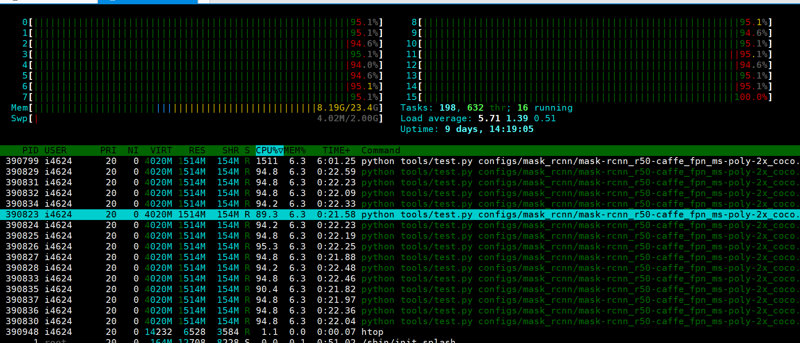
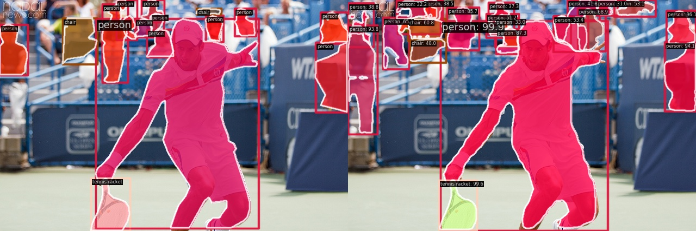

conda activate openmmlab 

MASK- rcnn
https://m.blog.naver.com/adamdoha/221906246483

** mmcv 오류가 발생하는 경우 아래의 Build-on-linux에 맞추어 mmcv를 별도로 빌드 후 설치 

https://mmcv.readthedocs.io/en/latest/get_started/build.html#build-on-linux 


최종적으로 작성하게 되는 명렁어 (터미널)
프로젝트 루트 폴더에서 시작
```
python tools/test.py configs/mask_rcnn/mask-rcnn_r50-caffe_fpn_ms-poly-2x_coco.py checkpoint/mask_rcnn_r50_caffe_fpn_mstrain-poly_2x_coco_bbox_mAP-0.403__segm_mAP-0.365_20200504_231822-a75c98ce.pth --show-dir results
```
관련 실행 명령어 자료 
https://mmdetection.readthedocs.io/en/v3.0.0/user_guides/test.html

사용한 가중치 
checkpoint/mask_rcnn_r50_caffe_fpn_mstrain-poly_2x_coco_bbox_mAP-0.403__segm_mAP-0.365_20200504_231822-a75c98ce.pth

결과물 링크 
```./work_dirs/mask-rcnn_r50-caffe_fpn_ms-poly-2x_coco```


requirements(from conda)
```python
# This file may be used to create an environment using:
# $ conda create --name <env> --file <this file>
# platform: linux-64
_libgcc_mutex=0.1=main
_openmp_mutex=5.1=1_gnu
addict=2.4.0=pypi_0
aliyun-python-sdk-core=2.14.0=pypi_0
aliyun-python-sdk-kms=2.16.2=pypi_0
blas=1.0=mkl
brotli-python=1.0.9=py38h6a678d5_7
bzip2=1.0.8=h7b6447c_0
ca-certificates=2023.08.22=h06a4308_0
certifi=2023.7.22=py38h06a4308_0
cffi=1.15.1=py38h5eee18b_3
charset-normalizer=2.0.4=pyhd3eb1b0_0
click=8.1.7=pypi_0
colorama=0.4.6=pypi_0
contourpy=1.1.1=pypi_0
cpuonly=2.0=0
crcmod=1.7=pypi_0
cryptography=41.0.3=py38hdda0065_0
cycler=0.12.1=pypi_0
cython=3.0.5=pypi_0
ffmpeg=4.3=hf484d3e_0
filelock=3.9.0=py38h06a4308_0
fonttools=4.44.0=pypi_0
freetype=2.12.1=h4a9f257_0
giflib=5.2.1=h5eee18b_3
gmp=6.2.1=h295c915_3
gmpy2=2.1.2=py38heeb90bb_0
gnutls=3.6.15=he1e5248_0
idna=3.4=py38h06a4308_0
importlib-metadata=6.8.0=pypi_0
importlib-resources=6.1.1=pypi_0
intel-openmp=2023.1.0=hdb19cb5_46305
jinja2=3.1.2=py38h06a4308_0
jmespath=0.10.0=pypi_0
jpeg=9e=h5eee18b_1
kiwisolver=1.4.5=pypi_0
lame=3.100=h7b6447c_0
lcms2=2.12=h3be6417_0
ld_impl_linux-64=2.38=h1181459_1
lerc=3.0=h295c915_0
libdeflate=1.17=h5eee18b_1
libffi=3.4.4=h6a678d5_0
libgcc-ng=11.2.0=h1234567_1
libgomp=11.2.0=h1234567_1
libiconv=1.16=h7f8727e_2
libidn2=2.3.4=h5eee18b_0
libjpeg-turbo=2.0.0=h9bf148f_0
libpng=1.6.39=h5eee18b_0
libstdcxx-ng=11.2.0=h1234567_1
libtasn1=4.19.0=h5eee18b_0
libtiff=4.5.1=h6a678d5_0
libunistring=0.9.10=h27cfd23_0
libwebp=1.3.2=h11a3e52_0
libwebp-base=1.3.2=h5eee18b_0
llvm-openmp=14.0.6=h9e868ea_0
lz4-c=1.9.4=h6a678d5_0
markdown=3.5.1=pypi_0
markdown-it-py=3.0.0=pypi_0
markupsafe=2.1.1=py38h7f8727e_0
matplotlib=3.7.3=pypi_0
mdurl=0.1.2=pypi_0
mkl=2023.1.0=h213fc3f_46343
mkl-service=2.4.0=py38h5eee18b_1
mkl_fft=1.3.8=py38h5eee18b_0
mkl_random=1.2.4=py38hdb19cb5_0
mmcv=2.1.0=dev_0
mmdet=3.2.0=dev_0
mmengine=0.9.1=pypi_0
model-index=0.1.11=pypi_0
mpc=1.1.0=h10f8cd9_1
mpfr=4.0.2=hb69a4c5_1
mpmath=1.3.0=py38h06a4308_0
ncurses=6.4=h6a678d5_0
nettle=3.7.3=hbbd107a_1
networkx=3.1=py38h06a4308_0
ninja=1.11.1.1=pypi_0
numpy=1.24.3=py38hf6e8229_1
numpy-base=1.24.3=py38h060ed82_1
opencv-python=4.8.1.78=pypi_0
opendatalab=0.0.10=pypi_0
openh264=2.1.1=h4ff587b_0
openjpeg=2.4.0=h3ad879b_0
openmim=0.3.9=pypi_0
openssl=3.0.12=h7f8727e_0
openxlab=0.0.28=pypi_0
ordered-set=4.1.0=pypi_0
oss2=2.17.0=pypi_0
packaging=23.2=pypi_0
pandas=2.0.3=pypi_0
pillow=10.0.1=py38ha6cbd5a_0
pip=23.3=py38h06a4308_0
platformdirs=3.11.0=pypi_0
psutil=5.9.6=pypi_0
pycocotools=2.0.7=pypi_0
pycparser=2.21=pyhd3eb1b0_0
pycryptodome=3.19.0=pypi_0
pygments=2.16.1=pypi_0
pyopenssl=23.2.0=py38h06a4308_0
pyparsing=3.1.1=pypi_0
pysocks=1.7.1=py38h06a4308_0
python=3.8.18=h955ad1f_0
python-dateutil=2.8.2=pypi_0
pytorch=2.1.0=py3.8_cpu_0
pytorch-mutex=1.0=cpu
pytz=2023.3.post1=pypi_0
pyyaml=6.0.1=py38h5eee18b_0
readline=8.2=h5eee18b_0
requests=2.28.2=pypi_0
rich=13.4.2=pypi_0
scipy=1.10.1=pypi_0
setuptools=60.2.0=pypi_0
shapely=2.0.2=pypi_0
six=1.16.0=pypi_0
sqlite=3.41.2=h5eee18b_0
sympy=1.11.1=py38h06a4308_0
tabulate=0.9.0=pypi_0
tbb=2021.8.0=hdb19cb5_0
termcolor=2.3.0=pypi_0
terminaltables=3.1.10=pypi_0
tk=8.6.12=h1ccaba5_0
tomli=2.0.1=pypi_0
torchvision=0.16.0=py38_cpu
tqdm=4.65.2=pypi_0
typing_extensions=4.7.1=py38h06a4308_0
tzdata=2023.3=pypi_0
urllib3=1.26.18=py38h06a4308_0
wheel=0.41.2=py38h06a4308_0
xz=5.4.2=h5eee18b_0
yaml=0.2.5=h7b6447c_0
yapf=0.40.2=pypi_0
zipp=3.17.0=pypi_0
zlib=1.2.13=h5eee18b_0
zstd=1.5.5=hc292b87_0
```

수행 결과 



----
original Readme
----


<div align="center">
  
  <div>&nbsp;</div>
  <div align="center">
    <b><font size="5">OpenMMLab website</font></b>
    <sup>
      <a href="https://openmmlab.com">
        <i><font size="4">HOT</font></i>
      </a>
    </sup>
    &nbsp;&nbsp;&nbsp;&nbsp;
    <b><font size="5">OpenMMLab platform</font></b>
    <sup>
      <a href="https://platform.openmmlab.com">
        <i><font size="4">TRY IT OUT</font></i>
      </a>
    </sup>
  </div>
  <div>&nbsp;</div>

[](https://pypi.org/project/mmdet)
[](https://mmdetection.readthedocs.io/en/latest/)
[](https://github.com/open-mmlab/mmdetection/actions)
[](https://codecov.io/gh/open-mmlab/mmdetection)
[](https://github.com/open-mmlab/mmdetection/blob/main/LICENSE)
[](https://github.com/open-mmlab/mmdetection/issues)
[](https://github.com/open-mmlab/mmdetection/issues)
[](https://openxlab.org.cn/apps?search=mmdet)

[📘Documentation](https://mmdetection.readthedocs.io/en/latest/) |
[🛠️Installation](https://mmdetection.readthedocs.io/en/latest/get_started.html) |
[👀Model Zoo](https://mmdetection.readthedocs.io/en/latest/model_zoo.html) |
[🆕Update News](https://mmdetection.readthedocs.io/en/latest/notes/changelog.html) |
[🚀Ongoing Projects](https://github.com/open-mmlab/mmdetection/projects) |
[🤔Reporting Issues](https://github.com/open-mmlab/mmdetection/issues/new/choose)

</div>

<div align="center">

English | [简体中文](README_zh-CN.md)

</div>

<div align="center">
  <a href="https://openmmlab.medium.com/" style="text-decoration:none;">
    </a>
  
  <a href="https://discord.com/channels/1037617289144569886/1046608014234370059" style="text-decoration:none;">
    </a>
  
  <a href="https://twitter.com/OpenMMLab" style="text-decoration:none;">
    </a>
  
  <a href="https://www.youtube.com/openmmlab" style="text-decoration:none;">
    </a>
  
  <a href="https://space.bilibili.com/1293512903" style="text-decoration:none;">
    </a>
  
  <a href="https://www.zhihu.com/people/openmmlab" style="text-decoration:none;">
    </a>
</div>

<div align="center">

</div>

## Introduction

MMDetection is an open source object detection toolbox based on PyTorch. It is
a part of the [OpenMMLab](https://openmmlab.com/) project.

The main branch works with **PyTorch 1.8+**.


<details open>
<summary>Major features</summary>

- **Modular Design**

  We decompose the detection framework into different components and one can easily construct a customized object detection framework by combining different modules.

- **Support of multiple tasks out of box**

  The toolbox directly supports multiple detection tasks such as **object detection**, **instance segmentation**, **panoptic segmentation**, and **semi-supervised object detection**.

- **High efficiency**

  All basic bbox and mask operations run on GPUs. The training speed is faster than or comparable to other codebases, including [Detectron2](https://github.com/facebookresearch/detectron2), [maskrcnn-benchmark](https://github.com/facebookresearch/maskrcnn-benchmark) and [SimpleDet](https://github.com/TuSimple/simpledet).

- **State of the art**

  The toolbox stems from the codebase developed by the *MMDet* team, who won [COCO Detection Challenge](http://cocodataset.org/#detection-leaderboard) in 2018, and we keep pushing it forward.
  The newly released [RTMDet](configs/rtmdet) also obtains new state-of-the-art results on real-time instance segmentation and rotated object detection tasks and the best parameter-accuracy trade-off on object detection.

</details>

Apart from MMDetection, we also released [MMEngine](https://github.com/open-mmlab/mmengine) for model training and [MMCV](https://github.com/open-mmlab/mmcv) for computer vision research, which are heavily depended on by this toolbox.

## What's New

### Highlight

**v3.2.0** was released in 12/10/2023:

**1. Detection Transformer SOTA Model Collection**
(1) Supported four updated and stronger SOTA Transformer models: [DDQ](configs/ddq/README.md), [CO-DETR](projects/CO-DETR/README.md), [AlignDETR](projects/AlignDETR/README.md), and [H-DINO](projects/HDINO/README.md).
(2) Based on CO-DETR, MMDet released a model with a COCO performance of 64.1 mAP.
(3) Algorithms such as DINO support `AMP/Checkpoint/FrozenBN`, which can effectively reduce memory usage.

**2. [Comprehensive Performance Comparison between CNN and Transformer](<(projects/RF100-Benchmark/README.md)>)**
RF100 consists of a dataset collection of 100 real-world datasets, including 7 domains. It can be used to assess the performance differences of Transformer models like DINO and CNN-based algorithms under different scenarios and data volumes. Users can utilize this benchmark to quickly evaluate the robustness of their algorithms in various scenarios.

<div align=center>

</div>

**3. Support for [GLIP](configs/glip/README.md) and [Grounding DINO](configs/grounding_dino/README.md) fine-tuning, the only algorithm library that supports Grounding DINO fine-tuning**
The Grounding DINO algorithm in MMDet is the only library that supports fine-tuning. Its performance is one point higher than the official version, and of course, GLIP also outperforms the official version.
We also provide a detailed process for training and evaluating Grounding DINO on custom datasets. Everyone is welcome to give it a try.

|       Model        | Backbone |   Style   |  COCO mAP  | Official COCO mAP |
| :----------------: | :------: | :-------: | :--------: | :---------------: |
|  Grounding DINO-T  |  Swin-T  | Zero-shot |    48.5    |       48.4        |
|  Grounding DINO-T  |  Swin-T  | Finetune  | 58.1(+0.9) |       57.2        |
|  Grounding DINO-B  |  Swin-B  | Zero-shot |    56.9    |       56.7        |
|  Grounding DINO-B  |  Swin-B  | Finetune  |    59.7    |                   |
| Grounding DINO-R50 |   R50    |  Scratch  | 48.9(+0.8) |       48.1        |

**4. Support for the open-vocabulary detection algorithm [Detic](projects/Detic_new/README.md) and multi-dataset joint training.**
**5. Training detection models using [FSDP and DeepSpeed](<(projects/example_largemodel/README.md)>).**

| ID  | AMP | GC of Backbone | GC of Encoder | FSDP | Peak Mem (GB) | Iter Time (s) |
| :-: | :-: | :------------: | :-----------: | :--: | :-----------: | :-----------: |
|  1  |     |                |               |      |   49 (A100)   |      0.9      |
|  2  |  √  |                |               |      |   39 (A100)   |      1.2      |
|  3  |     |       √        |               |      |   33 (A100)   |      1.1      |
|  4  |  √  |       √        |               |      |   25 (A100)   |      1.3      |
|  5  |     |       √        |       √       |      |      18       |      2.2      |
|  6  |  √  |       √        |       √       |      |      13       |      1.6      |
|  7  |     |       √        |       √       |  √   |      14       |      2.9      |
|  8  |  √  |       √        |       √       |  √   |      8.5      |      2.4      |

**6. Support for the [V3Det](configs/v3det/README.md) dataset, a large-scale detection dataset with over 13,000 categories.**

<div align=center>
    
</div>

We are excited to announce our latest work on real-time object recognition tasks, **RTMDet**, a family of fully convolutional single-stage detectors. RTMDet not only achieves the best parameter-accuracy trade-off on object detection from tiny to extra-large model sizes but also obtains new state-of-the-art performance on instance segmentation and rotated object detection tasks. Details can be found in the [technical report](https://arxiv.org/abs/2212.07784). Pre-trained models are [here](configs/rtmdet).

[](https://paperswithcode.com/sota/real-time-instance-segmentation-on-mscoco?p=rtmdet-an-empirical-study-of-designing-real)
[](https://paperswithcode.com/sota/object-detection-in-aerial-images-on-dota-1?p=rtmdet-an-empirical-study-of-designing-real)
[](https://paperswithcode.com/sota/object-detection-in-aerial-images-on-hrsc2016?p=rtmdet-an-empirical-study-of-designing-real)

| Task                     | Dataset | AP                                   | FPS(TRT FP16 BS1 3090) |
| ------------------------ | ------- | ------------------------------------ | ---------------------- |
| Object Detection         | COCO    | 52.8                                 | 322                    |
| Instance Segmentation    | COCO    | 44.6                                 | 188                    |
| Rotated Object Detection | DOTA    | 78.9(single-scale)/81.3(multi-scale) | 121                    |

<div align=center>

</div>

## Installation

Please refer to [Installation](https://mmdetection.readthedocs.io/en/latest/get_started.html) for installation instructions.

## Getting Started

Please see [Overview](https://mmdetection.readthedocs.io/en/latest/get_started.html) for the general introduction of MMDetection.

For detailed user guides and advanced guides, please refer to our [documentation](https://mmdetection.readthedocs.io/en/latest/):

- User Guides

  <details>

  - [Train & Test](https://mmdetection.readthedocs.io/en/latest/user_guides/index.html#train-test)
    - [Learn about Configs](https://mmdetection.readthedocs.io/en/latest/user_guides/config.html)
    - [Inference with existing models](https://mmdetection.readthedocs.io/en/latest/user_guides/inference.html)
    - [Dataset Prepare](https://mmdetection.readthedocs.io/en/latest/user_guides/dataset_prepare.html)
    - [Test existing models on standard datasets](https://mmdetection.readthedocs.io/en/latest/user_guides/test.html)
    - [Train predefined models on standard datasets](https://mmdetection.readthedocs.io/en/latest/user_guides/train.html)
    - [Train with customized datasets](https://mmdetection.readthedocs.io/en/latest/user_guides/train.html#train-with-customized-datasets)
    - [Train with customized models and standard datasets](https://mmdetection.readthedocs.io/en/latest/user_guides/new_model.html)
    - [Finetuning Models](https://mmdetection.readthedocs.io/en/latest/user_guides/finetune.html)
    - [Test Results Submission](https://mmdetection.readthedocs.io/en/latest/user_guides/test_results_submission.html)
    - [Weight initialization](https://mmdetection.readthedocs.io/en/latest/user_guides/init_cfg.html)
    - [Use a single stage detector as RPN](https://mmdetection.readthedocs.io/en/latest/user_guides/single_stage_as_rpn.html)
    - [Semi-supervised Object Detection](https://mmdetection.readthedocs.io/en/latest/user_guides/semi_det.html)
  - [Useful Tools](https://mmdetection.readthedocs.io/en/latest/user_guides/index.html#useful-tools)

  </details>

- Advanced Guides

  <details>

  - [Basic Concepts](https://mmdetection.readthedocs.io/en/latest/advanced_guides/index.html#basic-concepts)
  - [Component Customization](https://mmdetection.readthedocs.io/en/latest/advanced_guides/index.html#component-customization)
  - [How to](https://mmdetection.readthedocs.io/en/latest/advanced_guides/index.html#how-to)

  </details>

We also provide object detection colab tutorial [](demo/MMDet_Tutorial.ipynb) and instance segmentation colab tutorial [](demo/MMDet_InstanceSeg_Tutorial.ipynb).

To migrate from MMDetection 2.x, please refer to [migration](https://mmdetection.readthedocs.io/en/latest/migration.html).

## Overview of Benchmark and Model Zoo

Results and models are available in the [model zoo](docs/en/model_zoo.md).

<div align="center">
  <b>Architectures</b>
</div>
<table align="center">
  <tbody>
    <tr align="center" valign="bottom">
      <td>
        <b>Object Detection</b>
      </td>
      <td>
        <b>Instance Segmentation</b>
      </td>
      <td>
        <b>Panoptic Segmentation</b>
      </td>
      <td>
        <b>Other</b>
      </td>
    </tr>
    <tr valign="top">
      <td>
        <ul>
            <li><a href="configs/fast_rcnn">Fast R-CNN (ICCV'2015)</a></li>
            <li><a href="configs/faster_rcnn">Faster R-CNN (NeurIPS'2015)</a></li>
            <li><a href="configs/rpn">RPN (NeurIPS'2015)</a></li>
            <li><a href="configs/ssd">SSD (ECCV'2016)</a></li>
            <li><a href="configs/retinanet">RetinaNet (ICCV'2017)</a></li>
            <li><a href="configs/cascade_rcnn">Cascade R-CNN (CVPR'2018)</a></li>
            <li><a href="configs/yolo">YOLOv3 (ArXiv'2018)</a></li>
            <li><a href="configs/cornernet">CornerNet (ECCV'2018)</a></li>
            <li><a href="configs/grid_rcnn">Grid R-CNN (CVPR'2019)</a></li>
            <li><a href="configs/guided_anchoring">Guided Anchoring (CVPR'2019)</a></li>
            <li><a href="configs/fsaf">FSAF (CVPR'2019)</a></li>
            <li><a href="configs/centernet">CenterNet (CVPR'2019)</a></li>
            <li><a href="configs/libra_rcnn">Libra R-CNN (CVPR'2019)</a></li>
            <li><a href="configs/tridentnet">TridentNet (ICCV'2019)</a></li>
            <li><a href="configs/fcos">FCOS (ICCV'2019)</a></li>
            <li><a href="configs/reppoints">RepPoints (ICCV'2019)</a></li>
            <li><a href="configs/free_anchor">FreeAnchor (NeurIPS'2019)</a></li>
            <li><a href="configs/cascade_rpn">CascadeRPN (NeurIPS'2019)</a></li>
            <li><a href="configs/foveabox">Foveabox (TIP'2020)</a></li>
            <li><a href="configs/double_heads">Double-Head R-CNN (CVPR'2020)</a></li>
            <li><a href="configs/atss">ATSS (CVPR'2020)</a></li>
            <li><a href="configs/nas_fcos">NAS-FCOS (CVPR'2020)</a></li>
            <li><a href="configs/centripetalnet">CentripetalNet (CVPR'2020)</a></li>
            <li><a href="configs/autoassign">AutoAssign (ArXiv'2020)</a></li>
            <li><a href="configs/sabl">Side-Aware Boundary Localization (ECCV'2020)</a></li>
            <li><a href="configs/dynamic_rcnn">Dynamic R-CNN (ECCV'2020)</a></li>
            <li><a href="configs/detr">DETR (ECCV'2020)</a></li>
            <li><a href="configs/paa">PAA (ECCV'2020)</a></li>
            <li><a href="configs/vfnet">VarifocalNet (CVPR'2021)</a></li>
            <li><a href="configs/sparse_rcnn">Sparse R-CNN (CVPR'2021)</a></li>
            <li><a href="configs/yolof">YOLOF (CVPR'2021)</a></li>
            <li><a href="configs/yolox">YOLOX (CVPR'2021)</a></li>
            <li><a href="configs/deformable_detr">Deformable DETR (ICLR'2021)</a></li>
            <li><a href="configs/tood">TOOD (ICCV'2021)</a></li>
            <li><a href="configs/ddod">DDOD (ACM MM'2021)</a></li>
            <li><a href="configs/rtmdet">RTMDet (ArXiv'2022)</a></li>
            <li><a href="configs/conditional_detr">Conditional DETR (ICCV'2021)</a></li>
            <li><a href="configs/dab_detr">DAB-DETR (ICLR'2022)</a></li>
            <li><a href="configs/dino">DINO (ICLR'2023)</a></li>
            <li><a href="configs/glip">GLIP (CVPR'2022)</a></li>
            <li><a href="configs/ddq">DDQ (CVPR'2023)</a></li>
            <li><a href="projects/DiffusionDet">DiffusionDet (ArXiv'2023)</a></li>
            <li><a href="projects/EfficientDet">EfficientDet (CVPR'2020)</a></li>
            <li><a href="projects/ViTDet">ViTDet (ECCV'2022)</a></li>
            <li><a href="projects/Detic">Detic (ECCV'2022)</a></li>
            <li><a href="projects/CO-DETR">CO-DETR (ICCV'2023)</a></li>
      </ul>
      </td>
      <td>
        <ul>
          <li><a href="configs/mask_rcnn">Mask R-CNN (ICCV'2017)</a></li>
          <li><a href="configs/cascade_rcnn">Cascade Mask R-CNN (CVPR'2018)</a></li>
          <li><a href="configs/ms_rcnn">Mask Scoring R-CNN (CVPR'2019)</a></li>
          <li><a href="configs/htc">Hybrid Task Cascade (CVPR'2019)</a></li>
          <li><a href="configs/yolact">YOLACT (ICCV'2019)</a></li>
          <li><a href="configs/instaboost">InstaBoost (ICCV'2019)</a></li>
          <li><a href="configs/solo">SOLO (ECCV'2020)</a></li>
          <li><a href="configs/point_rend">PointRend (CVPR'2020)</a></li>
          <li><a href="configs/detectors">DetectoRS (ArXiv'2020)</a></li>
          <li><a href="configs/solov2">SOLOv2 (NeurIPS'2020)</a></li>
          <li><a href="configs/scnet">SCNet (AAAI'2021)</a></li>
          <li><a href="configs/queryinst">QueryInst (ICCV'2021)</a></li>
          <li><a href="configs/mask2former">Mask2Former (ArXiv'2021)</a></li>
          <li><a href="configs/condinst">CondInst (ECCV'2020)</a></li>
          <li><a href="projects/SparseInst">SparseInst (CVPR'2022)</a></li>
          <li><a href="configs/rtmdet">RTMDet (ArXiv'2022)</a></li>
          <li><a href="configs/boxinst">BoxInst (CVPR'2021)</a></li>
          <li><a href="projects/ConvNeXt-V2">ConvNeXt-V2 (Arxiv'2023)</a></li>
        </ul>
      </td>
      <td>
        <ul>
          <li><a href="configs/panoptic_fpn">Panoptic FPN (CVPR'2019)</a></li>
          <li><a href="configs/maskformer">MaskFormer (NeurIPS'2021)</a></li>
          <li><a href="configs/mask2former">Mask2Former (ArXiv'2021)</a></li>
          <li><a href="configs/XDecoder">XDecoder (CVPR'2023)</a></li>
        </ul>
      </td>
      <td>
        </ul>
          <li><b>Contrastive Learning</b></li>
        <ul>
        <ul>
          <li><a href="configs/selfsup_pretrain">SwAV (NeurIPS'2020)</a></li>
          <li><a href="configs/selfsup_pretrain">MoCo (CVPR'2020)</a></li>
          <li><a href="configs/selfsup_pretrain">MoCov2 (ArXiv'2020)</a></li>
        </ul>
        </ul>
        </ul>
          <li><b>Distillation</b></li>
        <ul>
        <ul>
          <li><a href="configs/ld">Localization Distillation (CVPR'2022)</a></li>
          <li><a href="configs/lad">Label Assignment Distillation (WACV'2022)</a></li>
        </ul>
        </ul>
          <li><b>Semi-Supervised Object Detection</b></li>
        <ul>
        <ul>
          <li><a href="configs/soft_teacher">Soft Teacher (ICCV'2021)</a></li>
        </ul>
        </ul>
      </ul>
      </td>
    </tr>
</td>
    </tr>
  </tbody>
</table>

<div align="center">
  <b>Components</b>
</div>
<table align="center">
  <tbody>
    <tr align="center" valign="bottom">
      <td>
        <b>Backbones</b>
      </td>
      <td>
        <b>Necks</b>
      </td>
      <td>
        <b>Loss</b>
      </td>
      <td>
        <b>Common</b>
      </td>
    </tr>
    <tr valign="top">
      <td>
      <ul>
        <li>VGG (ICLR'2015)</li>
        <li>ResNet (CVPR'2016)</li>
        <li>ResNeXt (CVPR'2017)</li>
        <li>MobileNetV2 (CVPR'2018)</li>
        <li><a href="configs/hrnet">HRNet (CVPR'2019)</a></li>
        <li><a href="configs/empirical_attention">Generalized Attention (ICCV'2019)</a></li>
        <li><a href="configs/gcnet">GCNet (ICCVW'2019)</a></li>
        <li><a href="configs/res2net">Res2Net (TPAMI'2020)</a></li>
        <li><a href="configs/regnet">RegNet (CVPR'2020)</a></li>
        <li><a href="configs/resnest">ResNeSt (ArXiv'2020)</a></li>
        <li><a href="configs/pvt">PVT (ICCV'2021)</a></li>
        <li><a href="configs/swin">Swin (CVPR'2021)</a></li>
        <li><a href="configs/pvt">PVTv2 (ArXiv'2021)</a></li>
        <li><a href="configs/resnet_strikes_back">ResNet strikes back (ArXiv'2021)</a></li>
        <li><a href="configs/efficientnet">EfficientNet (ArXiv'2021)</a></li>
        <li><a href="configs/convnext">ConvNeXt (CVPR'2022)</a></li>
        <li><a href="projects/ConvNeXt-V2">ConvNeXtv2 (ArXiv'2023)</a></li>
      </ul>
      </td>
      <td>
      <ul>
        <li><a href="configs/pafpn">PAFPN (CVPR'2018)</a></li>
        <li><a href="configs/nas_fpn">NAS-FPN (CVPR'2019)</a></li>
        <li><a href="configs/carafe">CARAFE (ICCV'2019)</a></li>
        <li><a href="configs/fpg">FPG (ArXiv'2020)</a></li>
        <li><a href="configs/groie">GRoIE (ICPR'2020)</a></li>
        <li><a href="configs/dyhead">DyHead (CVPR'2021)</a></li>
      </ul>
      </td>
      <td>
        <ul>
          <li><a href="configs/ghm">GHM (AAAI'2019)</a></li>
          <li><a href="configs/gfl">Generalized Focal Loss (NeurIPS'2020)</a></li>
          <li><a href="configs/seesaw_loss">Seasaw Loss (CVPR'2021)</a></li>
        </ul>
      </td>
      <td>
        <ul>
          <li><a href="configs/faster_rcnn/faster-rcnn_r50_fpn_ohem_1x_coco.py">OHEM (CVPR'2016)</a></li>
          <li><a href="configs/gn">Group Normalization (ECCV'2018)</a></li>
          <li><a href="configs/dcn">DCN (ICCV'2017)</a></li>
          <li><a href="configs/dcnv2">DCNv2 (CVPR'2019)</a></li>
          <li><a href="configs/gn+ws">Weight Standardization (ArXiv'2019)</a></li>
          <li><a href="configs/pisa">Prime Sample Attention (CVPR'2020)</a></li>
          <li><a href="configs/strong_baselines">Strong Baselines (CVPR'2021)</a></li>
          <li><a href="configs/resnet_strikes_back">Resnet strikes back (ArXiv'2021)</a></li>
        </ul>
      </td>
    </tr>
</td>
    </tr>
  </tbody>
</table>

Some other methods are also supported in [projects using MMDetection](./docs/en/notes/projects.md).

## FAQ

Please refer to [FAQ](docs/en/notes/faq.md) for frequently asked questions.

## Contributing

We appreciate all contributions to improve MMDetection. Ongoing projects can be found in out [GitHub Projects](https://github.com/open-mmlab/mmdetection/projects). Welcome community users to participate in these projects. Please refer to [CONTRIBUTING.md](.github/CONTRIBUTING.md) for the contributing guideline.

## Acknowledgement

MMDetection is an open source project that is contributed by researchers and engineers from various colleges and companies. We appreciate all the contributors who implement their methods or add new features, as well as users who give valuable feedbacks.
We wish that the toolbox and benchmark could serve the growing research community by providing a flexible toolkit to reimplement existing methods and develop their own new detectors.

## Citation

If you use this toolbox or benchmark in your research, please cite this project.

```
@article{mmdetection,
  title   = {{MMDetection}: Open MMLab Detection Toolbox and Benchmark},
  author  = {Chen, Kai and Wang, Jiaqi and Pang, Jiangmiao and Cao, Yuhang and
             Xiong, Yu and Li, Xiaoxiao and Sun, Shuyang and Feng, Wansen and
             Liu, Ziwei and Xu, Jiarui and Zhang, Zheng and Cheng, Dazhi and
             Zhu, Chenchen and Cheng, Tianheng and Zhao, Qijie and Li, Buyu and
             Lu, Xin and Zhu, Rui and Wu, Yue and Dai, Jifeng and Wang, Jingdong
             and Shi, Jianping and Ouyang, Wanli and Loy, Chen Change and Lin, Dahua},
  journal= {arXiv preprint arXiv:1906.07155},
  year={2019}
}
```

## License

This project is released under the [Apache 2.0 license](LICENSE).

## Projects in OpenMMLab

- [MMEngine](https://github.com/open-mmlab/mmengine): OpenMMLab foundational library for training deep learning models.
- [MMCV](https://github.com/open-mmlab/mmcv): OpenMMLab foundational library for computer vision.
- [MMPreTrain](https://github.com/open-mmlab/mmpretrain): OpenMMLab pre-training toolbox and benchmark.
- [MMagic](https://github.com/open-mmlab/mmagic): Open**MM**Lab **A**dvanced, **G**enerative and **I**ntelligent **C**reation toolbox.
- [MMDetection](https://github.com/open-mmlab/mmdetection): OpenMMLab detection toolbox and benchmark.
- [MMDetection3D](https://github.com/open-mmlab/mmdetection3d): OpenMMLab's next-generation platform for general 3D object detection.
- [MMRotate](https://github.com/open-mmlab/mmrotate): OpenMMLab rotated object detection toolbox and benchmark.
- [MMYOLO](https://github.com/open-mmlab/mmyolo): OpenMMLab YOLO series toolbox and benchmark.
- [MMSegmentation](https://github.com/open-mmlab/mmsegmentation): OpenMMLab semantic segmentation toolbox and benchmark.
- [MMOCR](https://github.com/open-mmlab/mmocr): OpenMMLab text detection, recognition, and understanding toolbox.
- [MMPose](https://github.com/open-mmlab/mmpose): OpenMMLab pose estimation toolbox and benchmark.
- [MMHuman3D](https://github.com/open-mmlab/mmhuman3d): OpenMMLab 3D human parametric model toolbox and benchmark.
- [MMSelfSup](https://github.com/open-mmlab/mmselfsup): OpenMMLab self-supervised learning toolbox and benchmark.
- [MMRazor](https://github.com/open-mmlab/mmrazor): OpenMMLab model compression toolbox and benchmark.
- [MMFewShot](https://github.com/open-mmlab/mmfewshot): OpenMMLab fewshot learning toolbox and benchmark.
- [MMAction2](https://github.com/open-mmlab/mmaction2): OpenMMLab's next-generation action understanding toolbox and benchmark.
- [MMTracking](https://github.com/open-mmlab/mmtracking): OpenMMLab video perception toolbox and benchmark.
- [MMFlow](https://github.com/open-mmlab/mmflow): OpenMMLab optical flow toolbox and benchmark.
- [MMEditing](https://github.com/open-mmlab/mmediting): OpenMMLab image and video editing toolbox.
- [MMGeneration](https://github.com/open-mmlab/mmgeneration): OpenMMLab image and video generative models toolbox.
- [MMDeploy](https://github.com/open-mmlab/mmdeploy): OpenMMLab model deployment framework.
- [MIM](https://github.com/open-mmlab/mim): MIM installs OpenMMLab packages.
- [MMEval](https://github.com/open-mmlab/mmeval): A unified evaluation library for multiple machine learning libraries.
- [Playground](https://github.com/open-mmlab/playground): A central hub for gathering and showcasing amazing projects built upon OpenMMLab.
