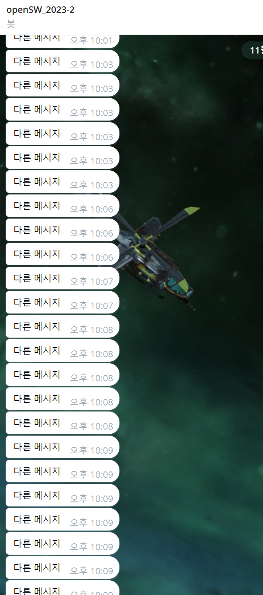
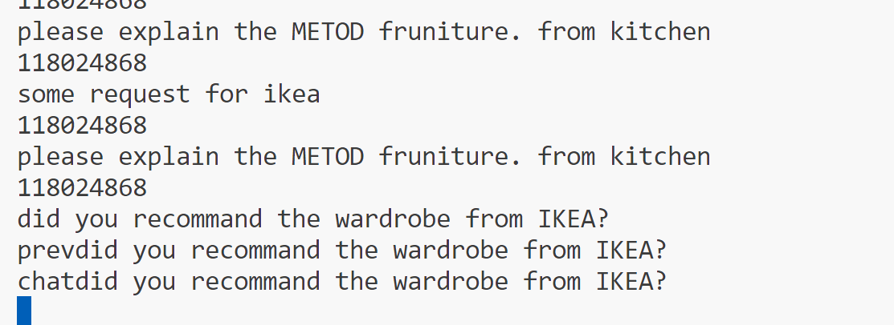
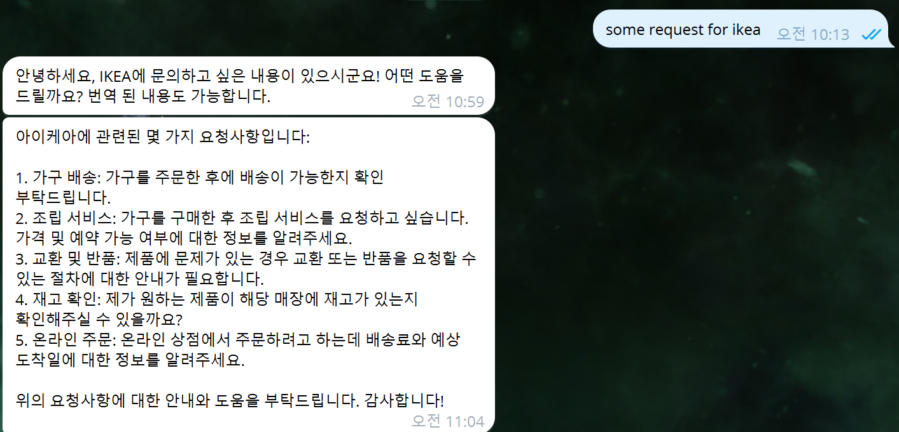
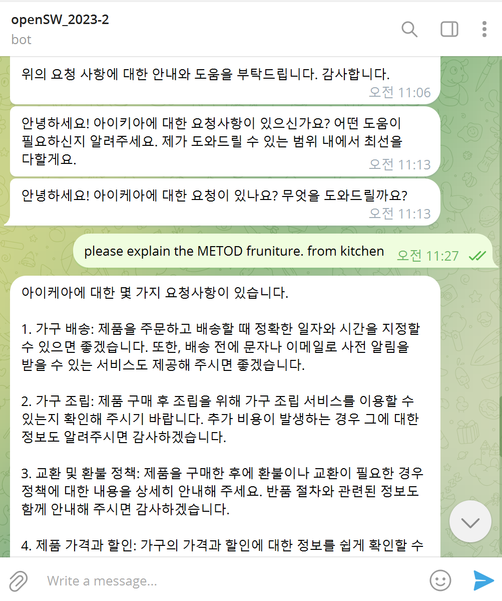
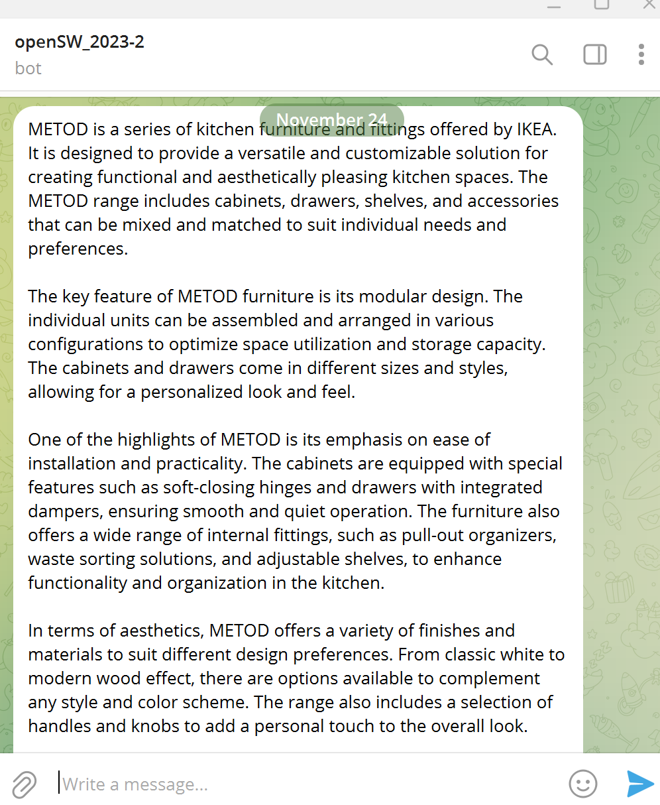
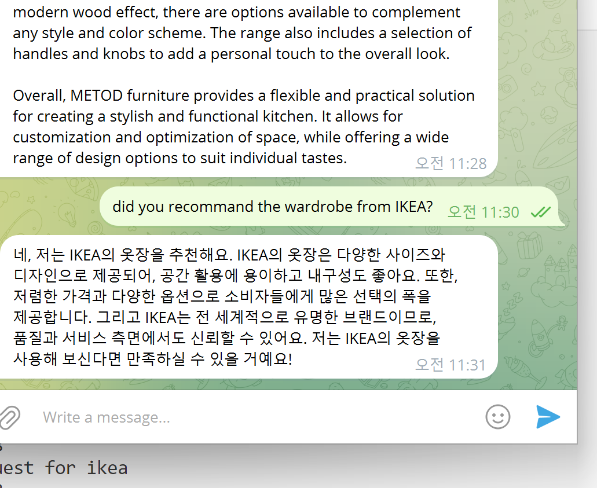

## openSW 수업 관련 레포지토리 

구조소개

```
메인 <- 모든게 다 들어간 폴더 
브랜치 <- 각 주제별로 들어간 브랜치 
코드 리포지토리는 별도로 작성 (간단한건 같이 들어감) 

문서는 거의 마크다운 형식 아니면 스프레드시트 파일 
```

### telegram bot series 

```bash
.env
.chat_id
.key
.token
```
4개는 미포함 

async_timer.py
* 대략 1800초(python async 동작 방식으로 인해 ms단위 오차가 있음) 단위로 알림이 등장하는 코드. 서울 시간대 기준 

open_ai_bot.py 
* 요청이 오면 그에 맞추어 finetuning 된 메시지를 내보내는 코드 
* finetuning setting 
```markdown
Response as korean language, even request message is english. way is not limited. It can be enable translate English to Korean
```
* 작동방식 
```
코드 실행 - 마지막 메시지 확인 - openAI api로 요청 보내기 - 응답 - 다른 메시지 확인하기  - 요청이 있으면 api로 요청 보내기 - 반복
                                                                                    - 요청이 없으면 10초간 대기 후 다시 메시지 확인 - 반복  
```

### 결과 이미지 






